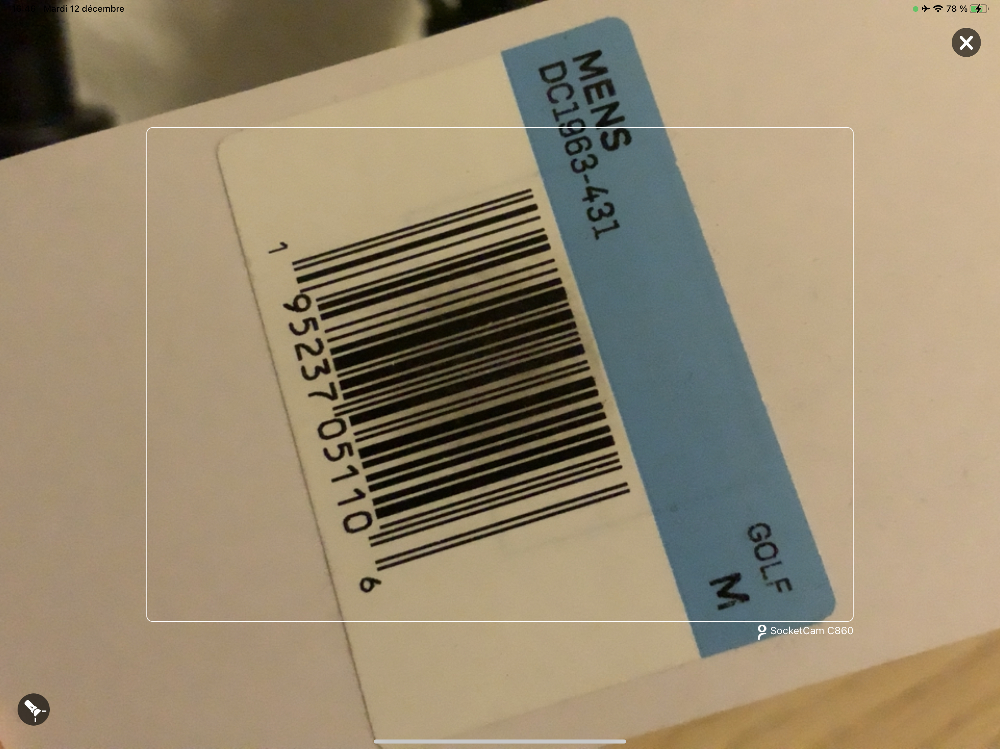
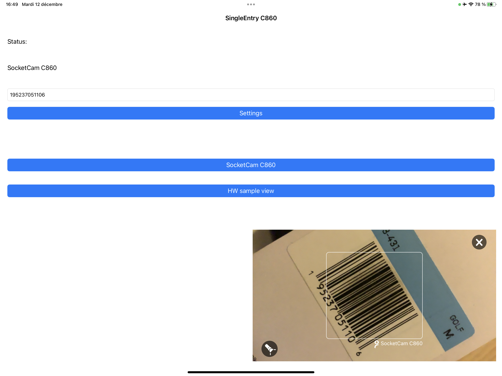
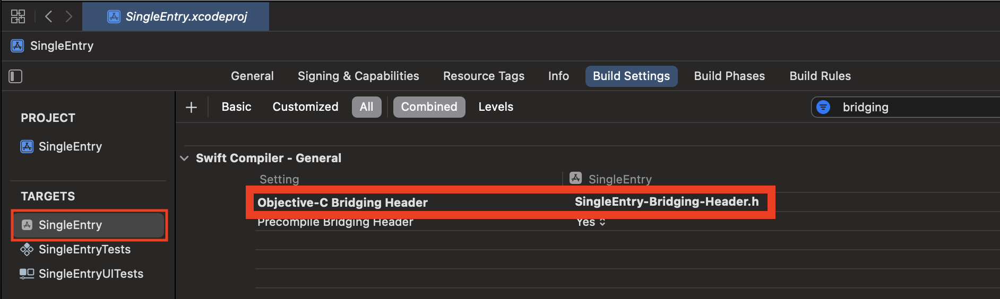
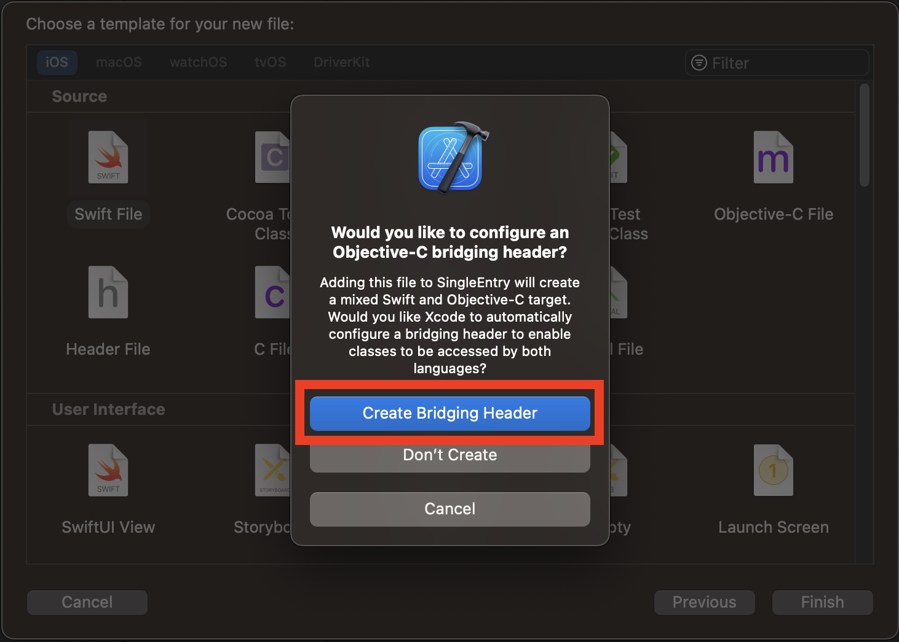

# ********************************************************
# THIS REPOSITORY HAS BEEN MOVED BEHIND OUR [DEVELOPERS PORTAL](https://www.socketmobile.com/dev-portal/portal)
# BUT PLEASE WATCH 👁️‍🗨️ ALL ACTIVITY IT AS WE REPORT THE README AND CHANGELOG HERE. YOU'LL BE NOTIFIED WITH:
# - Bug fixes
# - OS version update
# - Support of new products
# ********************************************************

# CaptureSDK Version 1.9.63 - Cocoapods

Socket Mobile is a leading innovator of data capture and delivery solutions for enhanced productivity.

CaptureSDK is the easiest solution for adding barcode scanning and RFID/NFC reading capability to an iOS application.

The Socket Mobile barcode scanner and contactless reader/writer are an ergonomic, fast and accurate solution to a variety of data entry scenarios.

This SDK is very easy to integrate to an application without requirement to follow a specific design architecture.

Within 10 minutes the barcode scanning or RFID/NFC reading capability can be integrated into an application.

The CaptureSDK offers a built-in barcode scanner called SocketCam, allowing to test and integrate the SDK even before getting a Socket Mobile scanner, using the exact same API, which makes the transition from using SocketCam to a Socket scanner totally frictionless.

More documentation can be found [here](https://docs.socketmobile.com/capture/ios/en/latest/ "CaptureSDK Documentation").

## Devices compatibility and CaptureSDK versions

|       Devices                                          |          < 1.4         |          1.4           |          1.5          |          1.6          |         1.7          |         1.8          |         1.9          |
| :----------------------------------------------------: | :--------------------: | :--------------------: | :-------------------: | :-------------------: |:-------------------: |:-------------------: |:-------------------: |
|   **SocketCam C820**                                   |          ❌            |           ✅           |           ✅           |           ✅          |           ✅         |           ✅         |           ✅         |
|   **S720/D720/S820**                                   |          ❌            |           ❌           |           ✅           |           ✅          |           ✅         |           ✅         |           ✅         |
|   **D600, S550, and all other barcode scanners**       |          ✅            |           ✅           |           ✅           |           ✅          |           ✅         |           ✅         |           ✅         |
|   **S370**                                             |          ❌            |           ❌           |           ❌           |           ✅          |           ✅         |           ✅         |           ✅         |
|   **M930**                                             |          ❌            |           ❌           |           ❌           |           ❌          |           ✅         |           ✅         |           ✅         |
|   **SocketCam C860**                                   |          ❌            |           ❌           |           ❌           |           ❌          |           ❌         |           ✅         |           ✅         |
|   **S320**                                             |          ❌            |           ❌           |           ❌           |           ❌          |           ❌         |           ❌         |           ✅         |

## Table of Contents

* [Breaking changes](#breaking-changes)
* [Quick install notes](#quick-install-notes)
* [SocketCam C820 and C860](#socketcam-c820-and-c860)
* [CaptureSDK usage](#capturesdk-usage)
* [Sample code](#sample-code)
* [Configure and connect a Socket Mobile device](#configure-and-connect-a-socket-mobile-device)
* [Device Notifications (Battery Level)](#device-notifications-battery-level)
* [Closing CaptureSDK](#closing-capturesdk)
* [Install notes for Objective-C projects](#install-notes-for-objective-c-projects)

## Breaking changes

We have improved and changed some things in our architecture to prepare the future. The SDK still works as you expect. However we have made some changes that don't require too much effort from you:

* The SDK is now a framework, not a static library anymore
* The minimum target is now iOS 13.0
* SocketCam C820 and SocketCam C860, formerly known as SoftScan has been improved and allows you to scan with your device and not with a scanner
* Capture Helper is now included into the framework - [CaptureHelper](https://docs.socketmobile.com/capture/ios/en/latest/captureHelper.html) for Swift, [SKTCaptureHelper](https://docs.socketmobile.com/capture/ios/en/latest/captureHelperObjectiveC.html) for Objective-C
* Bitcode has been enabled in the version 1.5.5 but disabled in the version 1.5.7 build with Xcode 14. If you need a version with Bitcode enabled, please use the 1.5.5

## Quick install notes

CaptureSDK is using CocoaPods.

First, you need to install CocoaPods on your machine by following the instructions found here: [Cocoapods](https://guides.cocoapods.org/using/getting-started.html)

To install the SDK to the application you need to create a file named `Podfile` in the same folder as your Xcode project is located.

The content of this file should be something like this assuming the name of your project is `myProject`:

You need to add an **additional source** to your `Podfile` in order to get those private pods in addition of the official Cocoapods and your private ones, if any.

```ruby
source 'https://github.com/CocoaPods/Specs.git'
source 'https://my-private-specs.git'
source 'https://oauth2:<YOUR-OAUTH-TOKEN-HERE>@sdk.socketmobile.com/capture/cocoapods-repo.git' // Socket Mobile private Cocoapods repository

target 'myProject'
  ...
  pod 'CaptureSDK', :git => 'https://oauth2:<YOUR-OAUTH-TOKEN-HERE>@sdk.socketmobile.com/capture/cocoapods-capturesdk.git'
  ...
end
```

Once you have saved this file, from the terminal command prompt, type the command `pod install` and make sure your current directory is where the Podfile is.

This creates a workspace file. If you have Xcode open on your project, you need to close it, and re-open your project using this time the workspace file.

From there you should be able to compile without error.

**VERY IMPORTANT**: Supported external accessory protocols array in the application settings.
In order to be able to use the Socket Mobile barcode scanners, the scanners external accessory protocol string needs to be added in the application project info in the **supported external accessory protocols array**.

The protocol string is `com.socketmobile.chs`.

If the application does use a Socket Mobile barcode scanner it will need to be MFi whitelisted before submitting the application in the App Store. Socket Mobile will handle the whitelist (MFi) application process for you, when you submit your app for MFi in your Socket Mobile developer account. This has to be done once for the first version supporting the barcode scanner.

You also need to add the following key to your `Info.plist`: **CFBundleAllowMixedLocalizations** (*Localized resources can be mixed*) to **`YES`**. That allows or SDK to display localized strings.

An AppKey is required in order to use CaptureSDK.

The AppKey can be generated by logging in Socket Mobile developer portal and registering your application.

This registration needs the Socket Mobile developer ID, the application Bundle ID (which is case sensitive).

Now you're ready to add `import CaptureSDK` in your main controller, and make it derive from one of the `CaptureHelperDelegate` that your application needs.

Go to the `CaptureHelperDelegate` source and copy paste the delegates you want to override, at minimum the onDecodedData delegate in order to be able to receive the barcode decoded data in your application.

## SocketCam C820 and C860

We have included `SocketCam C820` & `SocketCam C860` into the SDK, formerly known as SoftScan.

For SocketCam C860 is an enhanced version of SocketCam C820, you also need to add the following key to your `Info.plist`: **LSApplicationQueriesSchemes** (*Queried URL Schemes*) with a new item: **sktcompanion** (in lower case).

In order to use it you have to install [Socket Mobile Companion](https://apps.apple.com/app/socket-mobile-companion/id1175638950) on your device.

You can find more details about SocketCam C860 [on our website](https://www.socketmobile.com/readers-accessories/data-readers/camera-based-socketcam).

`SocketCam` feature refers to the capability of using the phone's camera in order to scan a barcode. The main purpose of integrating this feature in `CaptureSDK` is to provide a consistent interface to barcode readers.

Whether it is a Socket Mobile scanner, or simply the phone's camera, the application relies on the same interface, same API, which makes the transition from using SocketCam to a physical Socket scanner totally frictionless.

The application using the `SocketCam` feature needs to do 2 things differently, which Socket Mobile scanners don't require.

The first thing is to provide a trigger logic that starts the `SocketCam` scanning operation. The trigger is a `CaptureSDK` property `kSktCapturePropIdTriggerDevice` that exists since the first version of `CaptureSDK`.

A third property `kSktCapturePropIdSocketCamStatus` allows to enable or disable the `SocketCam` feature. This is a `CaptureSDK` property that is persistent across the life cycle of the application using it.

If the `SocketCam` feature is enabled, `CaptureSDK` will send a device arrival notification to the application referencing a `SocketCam` device the application can control.

Once the application triggers a read, the decoded data arrives the same way with the same information than as any other Socket Mobile devices supported by `CaptureSDK`.

For more information please check the [documentation](https://docs.socketmobile.com/capture/ios/en/latest/ "CaptureSDK Documentation").

With the new version of CaptureSDK available, you will be able to present SocketCam as you wish in a custom view, a popover and still in full screen. Now you decide where and when triggering and removing SocketCam view controller in your application's flow. And this is your responssability to handle the presentation and the dismissal of the view controller.
However, there's a minimal size of 250px x 250px to observe in order to display all SocketCam's UI elements.

BEFORE



AFTER



### Sample code

```swift
let scanner = CaptureHelperDevice()

scanner.setTrigger(.start, withCompletionHandler: { result, propertyObject in

    DispatchQueue.main.async {
        if let anObject = propertyObject?.object, let dic = anObject as? [String: Any], let objectType = dic["SKTObjectType"] as? String, objectType == "SKTSocketCamViewControllerType", let socketCamViewController = dic["SKTSocketCamViewController"] as? UIViewController {

            ////
            // Present the socketCamViewController in a popover or a subview or in full screen
            ////
        }
    }

})

extension YourViewController: CaptureHelperDeviceDecodedDataDelegate {

    // This delegate is called each time a decoded data is read from a scanner or SocketCam
    func didReceiveDecodedData(_ decodedData: SKTCaptureDecodedData?, fromDevice device: CaptureHelperDevice, withResult result:SKTResult) {
        print("--->>> didReceiveDecodedData for device: \(device.deviceInfo.deviceType)")
        if result == .E_NOERROR {
            let str = decodedData!.stringFromDecodedData()
            print("Decoded Data \(String(describing: str))")
            DispatchQueue.main.async {

                ////
                // When receiving your decoded data you can dismiss, hide, remove the SocketCam custom view controller
                ////

            }
        }
    }

}
```

Depending on how you want to display SocketCam in your application, it may require to show or hide the close button of the SocektCam view controller. Ideally, you can execute this at the device arrival of a SocketCam device, whether it is C820 or C860. In order to do so, add a specific configuration as follow:

```swift
let prop = SKTCaptureProperty()
prop.id = SKTCapturePropertyID.configuration
prop.type = .string
prop.stringValue = "SocketCamCloseButton=enabled" /// to show the close button
// OR
prop.stringValue = "SocketCamCloseButton=disabled" /// to hide the close button
self.captureHelper.setProperty(prop) { result, complete in

}
```

If you add the SocketCam view controller as a subview in another view controller (`myView.addsubview(self.socketCamViewController.view)`), then you need to remove the SocketCam view controller's view when you finish using it (`self.socketCamViewController.view.removeFromSuperview()`) otherwise it won't be displayed the next time you trigger SocketCam. So it's good to keep a reference on the SocketCam view controller when it is given by the CaptureHelper method `setTrigger`

## CaptureSDK usage

`CaptureSDK` is described in greater details in the [documentation](https://docs.socketmobile.com/capture/ios/en/latest/ "CaptureSDK Documentation").

The recommended way of using `CaptureSDK` is by using `CaptureHelper`. `CaptureHelper` is now included into the framework and not as a separate file. [CaptureHelper](https://docs.socketmobile.com/capture/ios/en/latest/captureHelper.html) for Swift, [SKTCaptureHelper](https://docs.socketmobile.com/capture/ios/en/latest/captureHelperObjectiveC.html) for Objective-C

### 1. Getting a `CaptureHelper` instance

`CaptureHelper` can be instantiated in one of your application controllers using its `CaptureHelper.sharedInstance` static member.

### 2. `CaptureHelper` delegates stack

The chosen controller must implement one of the `CaptureHelper[xxxxx]Delegate` protocols in order to receive the various `CaptureSDK` asynchronous events.

The reference of the controller deriving from at least one of the `CaptureHelper[xxxxx]Delegate` can be set by using the `CaptureHelper pushDelegate` method.

`CaptureHelper` maintains a delegates stack. The delegate on top of the stack is the one that receives the notification from `CaptureSDK`. So if the application has multiple views requiring the scanning feature, it can push a reference of a new view controller to the `CaptureHelper` delegates stack, and remove that reference when the view is no longer active.

### 3. Opening `CaptureHelper`

In order to start `CaptureSDK`, the API uses the `openWithAppInfo:withCompletionHandler` method with the application information.

This open method **can be called only once**, in the main view controller by example, and the `CaptureHelper.sharedInstance` can be used at various place in the application code as singleton reference without the need to pass it through various controllers.

The application information is retrieved from the Socket Mobile developer portal, by registering the application with its application ID, the developer ID. The application key is then generated and all three initialize the AppInfo required to open `CaptureSDK`.

The application ID is composed by the application bundle ID prefixed by the platform on which the application is designed to run.

Here is an example of such application ID: `"ios:com.socketmobile.SingleEntry"`. The application ID is **case sensitive**.

Once `CaptureSDK` is open, then the device arrival notification can occurs as soon as a scanner is connected to the iOS device.

The decoded data coming from the scanner can be retrieved by overriding the `onDecodedData` delegate.

### 4. Summary for integrating `CaptureSDK` in a Xcode project:

Example of ViewController.m for SingleEntry app:

```swift
import UIKit
import CaptureSDK

class MasterViewController:
  UITableViewController,
  CaptureHelperDevicePresenceDelegate,
  CaptureHelperDeviceManagerPresenceDelegate,
  CaptureHelperDeviceDecodedDataDelegate,
  CaptureHelperErrorDelegate,
  CaptureHelperDevicePowerDelegate {


  // Capture Helper shareInstance allows to share
  // the same instance of Capture Helper with the
  // entire application. That static property can
  // be used in any views but it is recommended
  // to open only once Capture Helper (in the main
  // view controller) and pushDelegate, popDelegate
  // each time a new view requiring scanning capability
  // is loaded or unloaded respectively.
  var captureHelper = CaptureHelper.sharedInstance

  override func viewDidLoad() {
      super.viewDidLoad()
      // Do any additional setup after loading the view, typically from a nib.
      // fill out the App Info with the Bundle ID which should start by the
      // platform on which the application is running and followed with the
      // case sensitive application Bundle ID,
      // with the Socket Mobile Portal developer ID
      // and with the Application Key generated from the Socket Mobile Developer
      // portal
      let AppInfo = SKTAppInfo()
      AppInfo.appKey = "MC0CFQD1tdTpaABkppmG+iP3dB9kolYVtwIUY8c3UmEfaPoTI3AxbPOTpNgw+fo="
      AppInfo.appID = "ios:com.socketmobile.SingleEntrySwift"
      AppInfo.developerID = "bb57d8e1-f911-47ba-b510-693be162686a"

      // there is a stack of delegates the last push is the
      // delegate active, when a new view requiring notifications from the
      // scanner, then push its delegate and pop its delegate when the
      // view is done
      captureHelper.pushDelegate(self)

      // to make all the delegates able to update the UI without the app
      // having to dispatch the UI update code, set the dispatchQueue
      // property to the DispatchQueue.main
      captureHelper.dispatchQueue = DispatchQueue.main

      // open Capture Helper only once in the application
      captureHelper.openWithAppInfo(AppInfo, withCompletionHandler: { (_ result: SKTResult) in
          print("Result of Capture initialization: \(result.rawValue)")
      })
  }
}
```

`CaptureHelper` makes the application aware of a new device connection by invoking the `onDeviceArrival` of the protocol and, in the same way when a device disconnects, the `onDeviceRemoval` is invoked. A `CaptureHelper` device instance representing the device that is connected can be used to retrieve or set a device property.

Example of the view controller being aware of the scanner:

```swift
func didNotifyArrivalForDevice(_ device: CaptureHelperDevice, withResult result: SKTResult) {
    print("Main view device arrival:\(device.deviceInfo.name!)")
}

func didNotifyRemovalForDevice(_ device: CaptureHelperDevice, withResult result: SKTResult) {
    print("Main view device removal:\(device.deviceInfo.name!)")
}
```

For a combo device like the S370 which has 2 devices, there will be two ``didNotifyArrivalForDevice`` and two ``didNotifyRemovalForDevice`` notifications.

The following code shows how you can distinghuish and handle them:

```swift
func didNotifyArrivalForDevice(_ device: CaptureHelperDevice, withResult result: SKTResult) {
    print("didNotifyArrivalForDevice: \(String(describing: device.deviceInfo.name))")
    if device.deviceInfo.deviceType == .NFCS370 {
    // handle the NFC reader of the S370
    } else if device.deviceInfo.deviceType == .scannerS370 {
    // handle the Barcode scanner of the S370
    }
}
```

If the scanner triggers a scan, the decoded data can be retrieve in the protocol function `onDecodedData`.

Example of retrieving the decoded data received by a scanner:

```swift
func didReceiveDecodedData(_ decodedData: SKTCaptureDecodedData?, fromDevice device: CaptureHelperDevice, withResult result: SKTResult) {
    if result == SKTCaptureErrors.E_NOERROR {
        let rawData = decodedData?.decodedData
        let rawDataSize = rawData?.count
        print("Size: \(String(describing: rawDataSize))")
        print("data: \(String(describing: decodedData?.decodedData))")
        let string = decodedData?.stringFromDecodedData()!
        print("Decoded Data \(String(describing: string))")
    }
}
```

The application can retrieve or modify the device properties by calling the various `CaptureHelperDevice` get/set methods. By example there is a method to retrieve the device friendly name: `getFriendlyNameWithCompletionHandler`. The call is asynchronous and will return immediately. The final result and the friendly name can be retrieved in the
completion handler function block.

**IMPORTANT**:
If a property is not accessible through the available `CaptureHelper` methods, it is very easy to add new ones, by creating a `CaptureHelper` **extension** class and copy and paste a similar get/set method and change the property settings inside the new method.

Creating a `CaptureHelper` extension allows to avoid an overwrite of a modified version of `CaptureHelper` when updating to a more recent `CaptureSDK` CocoaPods.

## Sample code

Sample code can be found in [GitHub / SocketMobile](https://github.com/SocketMobile "Socket Mobile Samples")

## Configure and connect a Socket Mobile device

`CaptureSDK` is designed for using all of the Socket Mobile devices on the iOS platforms.

As the application developer, `CaptureSDK` will give you full programmatic access to a connected Socket Mobile data capture device to customize the data source (barcode symbology or RFID Tag), data support and manage device feedback
messages and functions.

The API documentation for `CaptureSDK` can be found [here](https://docs.socketmobile.com/capture/ios/en/latest/ "Capture Documentation")

The Socket Mobile devices are shipped by default in **MFi mode** which is compatible with the `CaptureSDK`.

The device can be configured to the **Application mode** by using the [Socket
Mobile Companion app](https://itunes.apple.com/us/app/socket-mobile-companion/id1175638950?mt=8 "Socket Mobile Companion").

You can also refer to the [documentation](https://docs.socketmobile.com/capture/ios/en/latest/ConfigureInAppMode.html "Configure and connect scanner") for instructions without using Companion.

**BLE DEVICES**

For D600, S550 and S370, the BLE Device manager must have a favorite set to `*` and for more information please check the [documentation](https://docs.socketmobile.com/capture/ios/en/latest/ "CaptureSDK Documentation").

## Themes selection

The Themes Selection allows to choose LEDs sequences that are played on S550 or S370 devices. Please check the [documentation](https://docs.socketmobile.com/capture/ios/en/latest/topicsThemesSelection.html "CaptureSDK Documentation - Themes Selection").

## Device Notifications (Battery Level)

The Device Notifications can be configured in order to receive a notification each time one or more of those events occur:

* Battery Level change
* Power State change
* Buttons State change

By default the device notifications are turned off. The recommended usage is to first check if a particular notification is turned off or on. Depending on this reading, then the application can set a specific notification to be received if it is not already set. That setting stays persistent in the Socket Mobile device across scanner shutdown. It is not recommended to set systematically a notification in the device without checking first if that setting is already correct.

For the Battery Level and Power State, it could take a long time before the state changes, so usually the initial value is read using the corresponding `CaptureHelper` Get method.

Last, some devices don't support some of the notifications. If that's the case, an error `ESKT_NOTSUPPORTED (-15)` is returned when trying to set a notification that is not supported.

For more information please check the [documentation](https://docs.socketmobile.com/capture/ios/en/latest/ "CaptureSDK Documentation").

## Closing `CaptureSDK`

It is not recommended to close `CaptureSDK` because the scanner will go through reinitialization the next time `CaptureSDK` is open which causes a delay before being able to use the scanner.

Closing `CaptureSDK` does not affect power consumption, since the scanner stays connected to the iOS host anyway.

It is also worth noting that when the Socket Mobile device is connected the power consumption is really minimal, compare to establishing a connection.

If the motive of closing `CaptureSDK` is to not receive any decoded data from the device then the application delegate can simply be removed and the application will no longer receive any event from the scanner until it sets its delegate back again.

## Install notes for Objective-C projects

Our framework contains Swift code from now on so, in order to include `CaptureSDK` in a Objective-C project only, you need to add a `bridging header` file. It will make the bridge between Objective-C and Swift.

To add a bridging header file, follow those steps:

1. Create a file name `myProject-Bridging-Header.h` in your project folder and add it to your Xcode project and add `#import <CaptureSDK/CaptureSDK.h>` into this file

2. Then, in the **Build Settings** of the target(s), not the project, add the path of your bridging header file to `Objective-C Bridging Header` field



**OR**

1. Add a Swift file to your Xcode project and it will prompt you to add the briding header file. add it automatically for you



2. Add `#import <CaptureSDK/CaptureSDK.h>` into this bridging header file

3. If you're willing to use `Capture Helper`, please use [SKTCaptureHelper](https://docs.socketmobile.com/capture/ios/en/latest/captureHelperObjectiveC.html) for Objective-C which is suited for ObjectiveC
